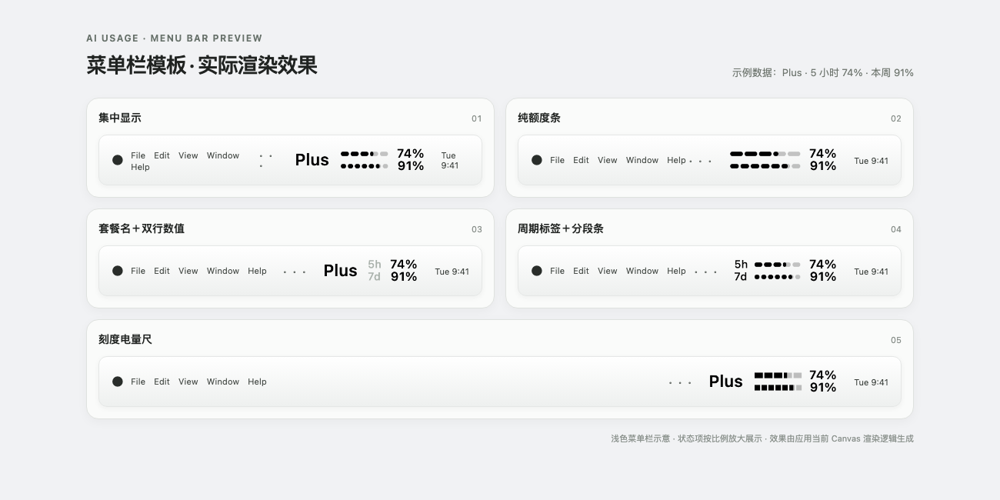
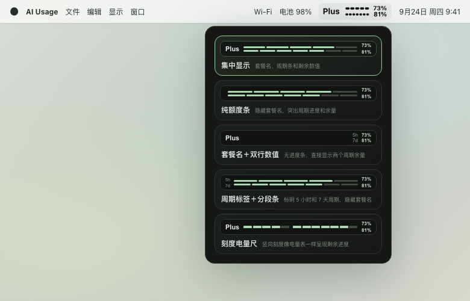

# AI Usage

**在 macOS 菜单栏查看 ChatGPT 套餐内 Codex 的剩余额度。**

AI Usage 是一款轻量的 Tauri 桌面应用。它从本机已登录的 Codex app-server 读取账号额度，并把 5 小时与 7 天窗口压缩成清晰的菜单栏指示。点击菜单栏图标可以切换显示样式。

> 这里显示的是 ChatGPT 套餐内 Codex 的官方使用额度，不代表 ChatGPT 网页聊天的总消息数。

## 功能

- **5 种菜单栏模板**：集中显示、纯额度条、套餐名加双行数值、周期标签分段条和刻度电量尺。
- **自动适配外观**：菜单栏图标使用 macOS 模板图像，随系统外观调整前景色。
- **自动适配面板高度**：模板列表变化时，选择窗口会跟随内容调整。
- **自动刷新**：额度每 30 秒读取一次；倒计时按更短间隔更新。读取失败时保留上次成功的数据。
- **尊重官方窗口周期**：周期长度与重置时间以账号服务返回的数据为准。



*示例额度用于展示样式；为方便查看，状态栏区域按比例放大。*



*下拉面板为当前 Vue 界面截图，使用示例额度；选中模板以绿色边框标识。*

## 额度读取与计算

应用调用本机 Codex app-server 的 `account/rateLimits/read` 接口读取套餐额度。解析时优先采用账号响应中的 `rateLimits`；仅当它缺失或为 `null` 时，才回退到 `rateLimitsByLimitId.codex`。不会把 Credits 或其他额度分桶合并进套餐主额度。

剩余百分比按 `100 - usedPercent` 计算，并限制在 0% 到 100% 之间。窗口的周期和重置时间采用服务端返回值，不假设 `primary` 永远是 5 小时。完整口径和边界情况见[额度计算说明](docs/quota-source.md)。

## 系统要求

- macOS 13 或更新版本
- 已登录 ChatGPT 桌面应用、Codex 桌面应用，或 Codex CLI
- 如使用 CLI，请确保 `codex` 可从常见安装位置找到，或设置 `CODEX_BINARY` 指向可执行文件

## 开发运行

开发环境需要 Node.js、Rust，以及 npm 或 Yarn。安装依赖后启动 Tauri 开发模式：

```sh
npm install
npm run dev
```

仅运行前端页面可使用：

```sh
npm run dev:web
```

## 构建

```sh
npm run build
```

安装包输出到 `src-tauri/target/release/bundle/`。本地构建产物未签名或公证，首次打开时 macOS 可能提示确认。

GitHub Actions 会在 `master` 分支推送、Pull Request 和手动触发时构建 Apple Silicon 与 Intel 版本，并将 DMG 作为 workflow artifact 保存 14 天。推送到 `master` 且两种架构的构建都通过后，会自动创建 GitHub Release 并附上安装包。

## 隐私与数据

- AI Usage 通过本机 Codex app-server 查询额度，不直接连接额度服务，也不读取或输出账号凭据。
- 应用不会读取会话记录、提示词或回复内容。
- 当前额度快照仅用于本机菜单栏显示。

## 已知范围

目前只展示 ChatGPT 套餐中 Codex 的官方额度。账号暂未提供额度、登录状态失效或本机找不到 Codex app-server 时，菜单栏会显示不可用状态；额度周期和可用窗口由账号服务决定。

## 致谢

感谢 [Metrik](https://github.com/keros68/metrik) 项目对额度状态呈现方式的启发。本项目根据自身的数据来源和菜单栏交互独立实现。

## 许可证

[MIT License](LICENSE)
